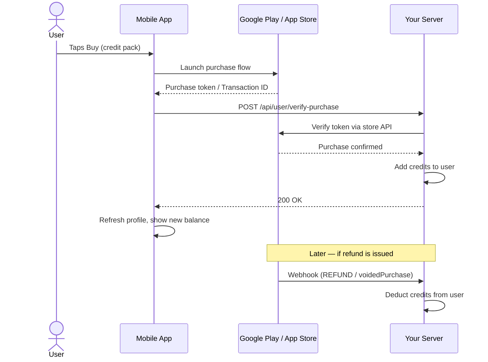

# IAP & Webhook API Docs

This folder documents the three APIs that handle in-app purchases for Android and iOS. The app currently uses **IAP only** (one-time credit pack purchases). Subscription support is implemented and ready but not active.

| Document | Endpoint | Who calls it | Auth |
|---|---|---|---|
| [verify-purchase.md](./verify-purchase.md) | `POST /api/user/verify-purchase` | Mobile app — immediately after checkout | JWT required |
| [google-play-webhook.md](./google-play-webhook.md) | `POST /api/user/webhook/google-play` | Google Play servers (automatic) | None |
| [apple-appstore-webhook.md](./apple-appstore-webhook.md) | `POST /api/user/webhook/apple-appstore` | Apple servers (automatic) | None |

---

## How IAP Works

---

## IAP vs Subscription — What the Webhook Does

| Event | Google Play | Apple App Store |
|---|---|---|
| User buys credit pack | `verify-purchase` adds credits. Webhook checks for double-credit and skips if already credited. Webhook adds credits only if `verify-purchase` was never called (app crash fallback). | `verify-purchase` adds credits. Apple sends **no** purchase webhook for consumables. |
| Refund / void | `voidedPurchaseNotification` (productType=1) → credits deducted | `REFUND` notification → credits deducted |
| Purchase canceled before payment collected | `ONE_TIME_PRODUCT_CANCELED` (type 2) → logged, no action (no credits were ever added) | Not applicable for consumables |

---

## What the App Needs to Do

- **Call `verify-purchase` once** right after the user completes checkout. This is the only IAP-related API call the app makes.
- **Refresh the user profile** (`GET /api/user/profile`) after a successful `verify-purchase` response and whenever the app returns to the foreground, to pick up any credit changes from webhooks (e.g. a refund processed while the app was closed).
- The webhook endpoints are called by Google and Apple's servers automatically — **the app never calls them directly**.

---

## PlansTable Setup (Required for Webhooks)

The webhooks look up the credit amount by matching the store's product ID against `PlansTable`. Without this, webhooks cannot add or deduct credits.

| Field | Google Play | Apple App Store |
|---|---|---|
| `playStoreId` | Must match the **Product ID** in Google Play Console | Not used |
| `appStoreId` | Not used | Must match the **Product ID** in App Store Connect |
| `credits` | Credits to add on purchase / deduct on refund | Same |

---

## Shared DynamoDB Tables

| Table | Purpose |
|---|---|
| `UsersTable` | User records — `credits`, `subscriptionStatus`, `planId`, `lastPurchaseToken` |
| `PlansTable` | Plan/product catalog — matched by `playStoreId` or `appStoreId` |
| `UserPurchasesTable` | `purchaseToken → { email, productId, store, purchaseType }` — idempotency index used by webhooks to prevent double-crediting |
