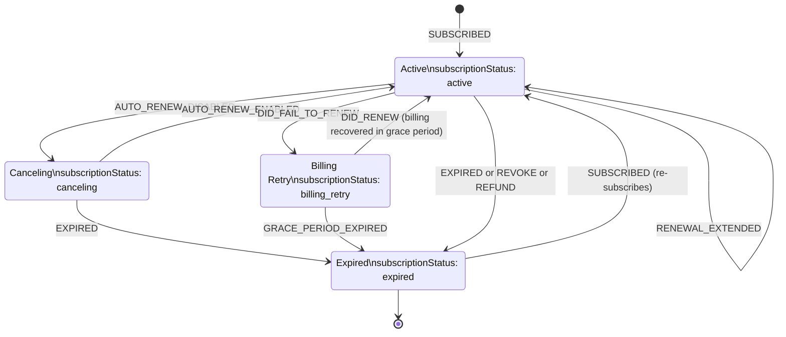
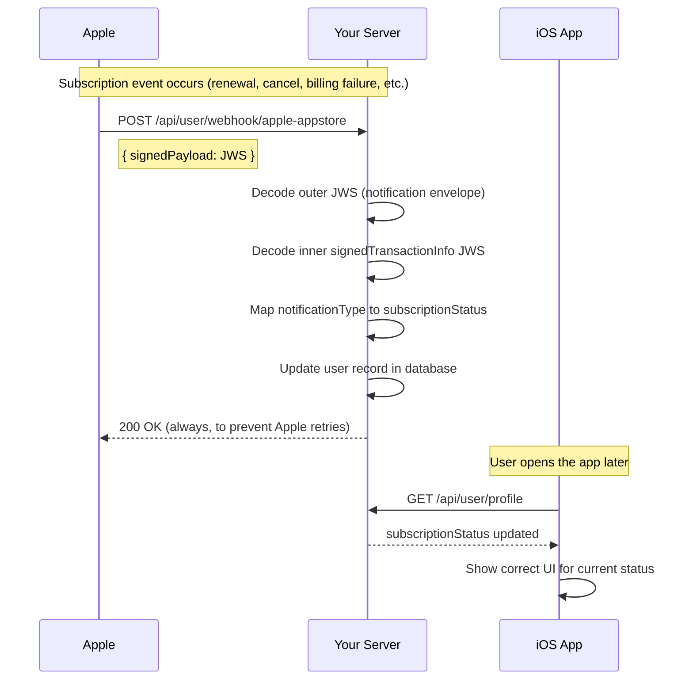

# Apple App Store Webhook

This endpoint receives real-time App Store Server Notifications (V2 / StoreKit 2) from Apple. It is called automatically by Apple's infrastructure — **your iOS app does not call this endpoint**.

Understanding what this webhook handles helps you know what subscription state changes your app should expect and when to refresh the user's profile.

---

## Endpoint

```
POST /api/user/webhook/apple-appstore
```

**Auth:** None — called by Apple's servers, not the app  
**Your app's role:** None. Just refresh the user profile when the app comes to the foreground.

---

## What This Webhook Handles

Apple sends a notification for every subscription or consumable lifecycle event. The server processes these and updates the user's subscription status automatically.

### Subscription events (`Auto-Renewable Subscription`)

| `notificationType` | `subtype` | What it means | Resulting status |
|---|---|---|---|
| `SUBSCRIBED` | any | New subscription or re-subscribe after lapse | `active` |
| `DID_RENEW` | any | Auto-renewed successfully | `active` |
| `OFFER_REDEEMED` | any | Promotional or offer code redeemed | `active` |
| `RENEWAL_EXTENDED` | any | Renewal date extended by developer | `active` |
| `REFUND_REVERSED` | any | A previous refund was reversed | `active` |
| `DID_CHANGE_RENEWAL_STATUS` | `AUTO_RENEW_ENABLED` | User re-enabled auto-renew | `active` |
| `EXPIRED` | any | Subscription has fully expired | `expired` |
| `REVOKE` | any | Family Sharing access was revoked | `expired` |
| `REFUND` | any | Refund was granted | `expired` |
| `DID_FAIL_TO_RENEW` | any | Billing failed | `billing_retry` |
| `PRICE_INCREASE` | any | Price increase pending user consent | `billing_retry` |
| `GRACE_PERIOD_EXPIRED` | any | Grace period ended without payment | `billing_retry` |
| `DID_CHANGE_RENEWAL_STATUS` | `AUTO_RENEW_DISABLED` | User turned off auto-renew | `canceling` |

### Consumable events

| `notificationType` | What it means | Action taken |
|---|---|---|
| `REFUND` | Refund granted on a consumable purchase | Logged for review |

### Subscription Lifecycle



---

## Subscription Status Reference

| `subscriptionStatus` | Meaning | Recommended UI |
|---|---|---|
| `active` | Subscription is valid and paid | Full access |
| `canceling` | Auto-renew is off; still active until period ends | Show "Renew" prompt, user still has access |
| `billing_retry` | Payment failed, Apple is retrying | Prompt user to update payment in Settings |
| `expired` | Subscription has ended | Show paywall / upsell screen |
| *(absent / null)* | User has never subscribed | Show paywall |

---

## What Your App Should Do

Your app does not need to listen for or react to these webhook events in real time. Instead:

1. **After a successful `verify-purchase` call** — refresh the user profile to reflect the newly activated plan.
2. **On app foreground / resume** — call `GET /api/user/profile` to pick up any status changes that happened while the app was closed (renewals, cancellations, billing failures, etc.).
3. **Handle `Transaction.updates` in StoreKit 2** — always listen for transaction updates in your app so StoreKit can deliver any purchases that completed while the app was in the background.

**Swift example — listening for transaction updates on app launch:**

```swift
// In your App or main scene
.task {
    for await result in Transaction.updates {
        guard case .verified(let transaction) = result else { continue }
        // Re-verify with your server if needed
        await transaction.finish()
    }
}
```

---

## Notes

- **Renewals are silent** — the App Store renews subscriptions automatically and sends a `DID_RENEW` notification to the webhook. Your app just needs to re-fetch the user profile periodically to reflect the latest state.
- `canceling` (`DID_CHANGE_RENEWAL_STATUS` / `AUTO_RENEW_DISABLED`) means the user turned off auto-renew but is still active until the end of the billing period. The status will change to `expired` when `EXPIRED` is received.
- To deep-link the user to the App Store subscription management page:
  ```swift
  if let url = URL(string: "https://apps.apple.com/account/subscriptions") {
      await UIApplication.shared.open(url)
  }
  ```
- For sandbox testing, use a Sandbox Apple ID and set your app to the sandbox environment. Apple sends sandbox notifications to the same registered endpoint.

---

## Notification and Sync Flow


