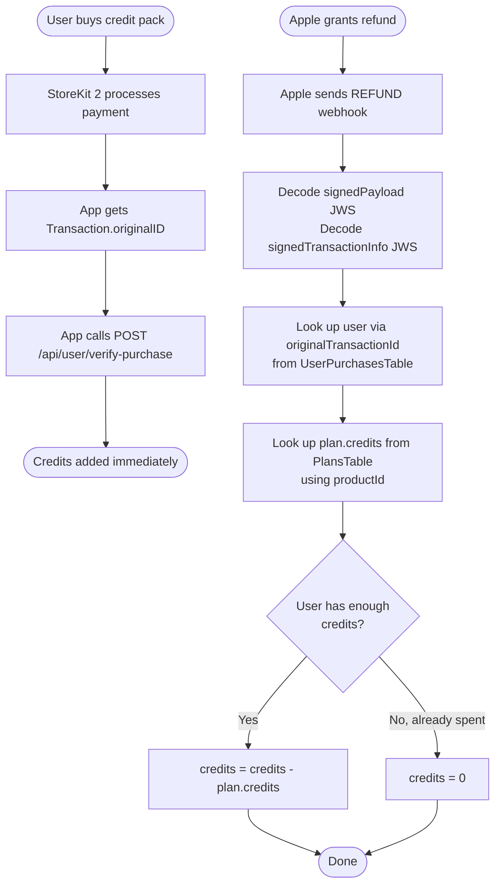
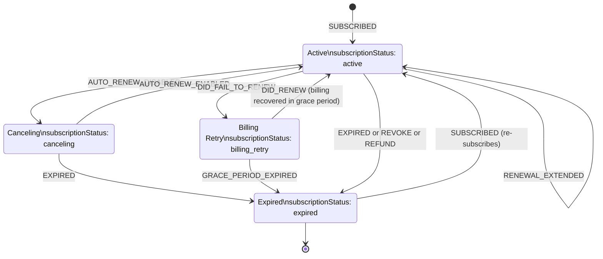
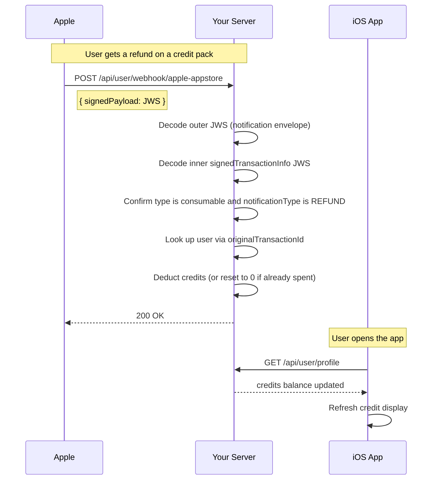

# Apple App Store Webhook

This endpoint receives real-time App Store Server Notifications (V2 / StoreKit 2) from Apple for both **IAP (one-time consumable credit packs)** and auto-renewable subscriptions. It is called automatically by Apple's infrastructure — **your iOS app never calls this endpoint directly**.

---

## Endpoint

```
POST /api/user/webhook/apple-appstore
```

**Auth:** None — called by Apple's servers, not the app  
**Your app's role:** None. Call `GET /api/user/profile` when the app comes to the foreground to pick up any changes.

---

## What This Webhook Handles

Apple sends a signed JWS payload containing a `notificationType` for every lifecycle event.

### IAP (Consumable) events

Fired when a refund is granted on a one-time credit pack purchase.

| `notificationType` | `type` in transaction | What it means | Action taken |
|---|---|---|---|
| `REFUND` | non-subscription | Apple granted a refund on a consumable purchase | Deduct `plan.credits` from user — if already spent, reset `credits` to `0` |

> Apple does **not** send a `PURCHASED` notification for consumables. Your app calls `verify-purchase` directly after the StoreKit transaction completes — that is the only path for adding credits. This webhook only handles the refund case.

### Subscription events

| `notificationType` | `subtype` | What it means | Resulting `subscriptionStatus` |
|---|---|---|---|
| `SUBSCRIBED` | any | New subscription or re-subscribe after lapse | `active` |
| `DID_RENEW` | any | Auto-renewed successfully | `active` |
| `OFFER_REDEEMED` | any | Promotional or offer code redeemed | `active` |
| `RENEWAL_EXTENDED` | any | Renewal date extended by developer | `active` |
| `REFUND_REVERSED` | any | A previous refund was reversed | `active` |
| `DID_CHANGE_RENEWAL_STATUS` | `AUTO_RENEW_ENABLED` | User re-enabled auto-renew | `active` |
| `EXPIRED` | any | Subscription has fully expired | `expired` |
| `REVOKE` | any | Family Sharing access was revoked | `expired` |
| `REFUND` | any | Refund was granted on a subscription | `expired` |
| `DID_FAIL_TO_RENEW` | any | Billing failed | `billing_retry` |
| `PRICE_INCREASE` | any | Price increase pending user consent | `billing_retry` |
| `GRACE_PERIOD_EXPIRED` | any | Grace period ended without payment | `billing_retry` |
| `DID_CHANGE_RENEWAL_STATUS` | `AUTO_RENEW_DISABLED` | User turned off auto-renew | `canceling` |

---

## IAP Lifecycle

Apple does **not** send a webhook when a consumable is purchased — the only webhook Apple sends for consumables is a `REFUND`. This means the credit-add path always goes through `verify-purchase`, and the webhook only runs the credit-deduct path.



---

## Subscription Lifecycle



---

## Subscription Status Reference

| `subscriptionStatus` | Meaning | Recommended UI |
|---|---|---|
| `active` | Subscription is valid and paid | Full access |
| `canceling` | Auto-renew is off; still active until period ends | Show "Renew" prompt, user still has access |
| `billing_retry` | Payment failed, Apple is retrying | Prompt user to update payment in Settings |
| `expired` | Subscription has ended | Show paywall / upsell screen |
| *(absent / null)* | User has never subscribed | Show paywall |

---

## What Your App Should Do

Your app does not react to these webhook events in real time. Instead:

1. **After `verify-purchase` returns 200** — refresh the user profile to show the updated credit balance.
2. **On app foreground / resume** — call `GET /api/user/profile` to pick up any changes (including refund deductions) that happened while the app was closed.
3. **Read the `credits` field** from the profile response to show the current balance.
4. **Handle `Transaction.updates` in StoreKit 2** — always listen for transaction updates so StoreKit can deliver purchases that completed while the app was in the background.

**Swift example — listening for transaction updates on app launch:**

```swift
// In your App or main scene
.task {
    for await result in Transaction.updates {
        guard case .verified(let transaction) = result else { continue }
        // Call verify-purchase with transaction.originalID if not yet processed
        await transaction.finish()
    }
}
```

---

## PlansTable Requirement

The webhook resolves the number of credits to deduct on a refund by scanning `PlansTable` for a row where `appStoreId` matches the `productId` in the refunded transaction.

**Each plan row must have:**

| Field | Example | Description |
|---|---|---|
| `appStoreId` | `"credits_100"` | Must exactly match the Product ID in App Store Connect |
| `credits` | `100` | Number of credits to deduct on refund |

If `appStoreId` is missing or doesn't match, the webhook logs a warning and takes no action.

---

## Notes

- **No webhook on purchase** — Apple does not send a notification when a consumable is purchased. Credits are always added by `verify-purchase`. This webhook only handles the `REFUND` case.
- **Refund deduction logic** — if the user already spent the credits before the refund was processed, `credits` is reset to `0` rather than going negative.
- **Apple always gets `200`** — Apple retries failed deliveries with exponential backoff for up to 60 days. The server always returns `200` to acknowledge receipt even when nothing needs to be done; idempotency at the application level handles duplicates.
- **Sandbox testing** — register both Production and Sandbox URLs in App Store Connect. Apple uses separate servers for sandbox notifications, so both must point to the same endpoint.

---

## Notification and Sync Flow


