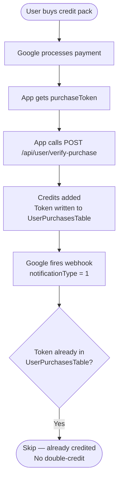
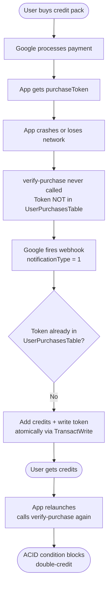
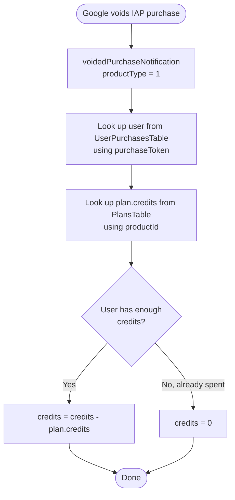
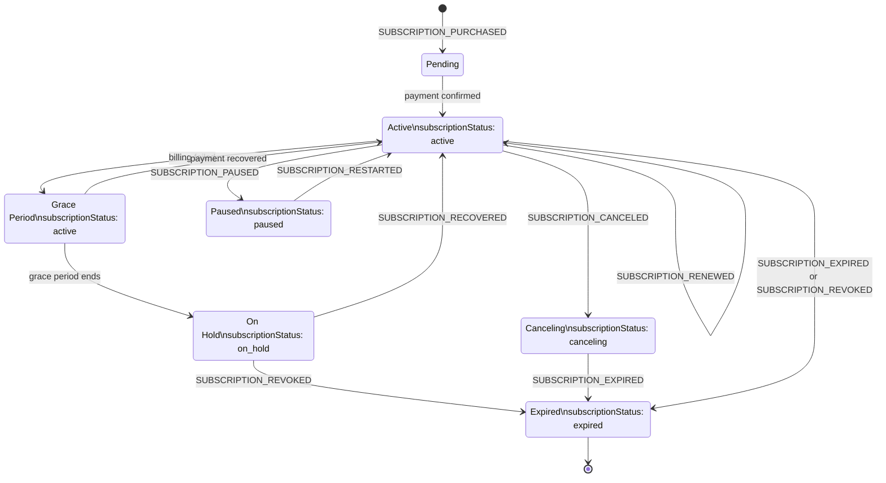
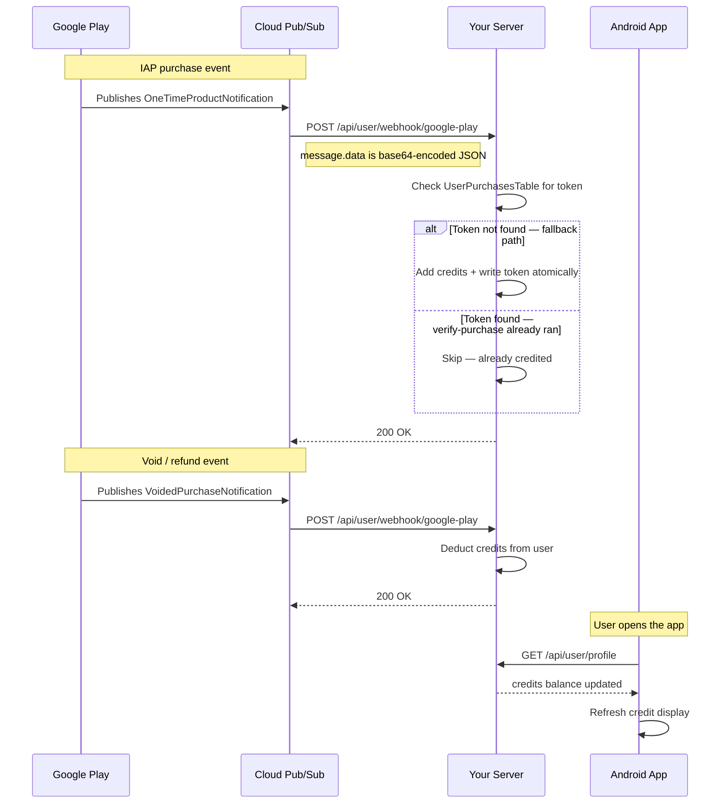

# Google Play Webhook

This endpoint receives real-time notifications from Google Play for both **IAP (one-time credit packs)** and subscriptions. It is called automatically by Google's infrastructure via Cloud Pub/Sub — **your Android app never calls this endpoint directly**.

---

## Endpoint

```
POST /api/user/webhook/google-play
```

**Auth:** None — called by Google's servers, not the app  
**Your app's role:** None. Call `GET /api/user/profile` when the app comes to the foreground to pick up any changes.

---

## What This Webhook Handles

Google Play sends one of three notification shapes depending on what happened.

### IAP (One-Time Product) events

Fired when a user buys or cancels a one-time credit pack.

| `notificationType` | Name | What it means | Action taken |
|---|---|---|---|
| `1` | `ONE_TIME_PRODUCT_PURCHASED` | Payment completed | Idempotency check → credits added only if `verify-purchase` has not already run for this token |
| `2` | `ONE_TIME_PRODUCT_CANCELED` | Purchase canceled before fulfillment (pending payment failed or timed out) | Logged — no credits were ever added, nothing to revert |

### Voided purchase events

Fired when Google or the developer issues a refund after the purchase was already fulfilled.

| `productType` | What it means | Action taken |
|---|---|---|
| `0` (subscription) | Subscription purchase voided | `subscriptionStatus` set to `expired` |
| `1` (IAP) | Credit pack purchase voided / refunded | Credits deducted from user (reset to `0` if user already spent them) |

### Subscription events

| Event | What it means | Resulting `subscriptionStatus` |
|---|---|---|
| `SUBSCRIPTION_PURCHASED` | New subscription started | `active` |
| `SUBSCRIPTION_RENEWED` | Auto-renewed successfully | `active` |
| `SUBSCRIPTION_RECOVERED` | Recovered after billing hold | `active` |
| `SUBSCRIPTION_IN_GRACE_PERIOD` | Billing failed, grace period active | `active` |
| `SUBSCRIPTION_RESTARTED` | User reactivated a cancelled subscription | `active` |
| `SUBSCRIPTION_PRICE_CHANGE_CONFIRMED` | User accepted a price change | `active` |
| `SUBSCRIPTION_CANCELED` | User cancelled auto-renew (still active until period end) | `canceling` |
| `SUBSCRIPTION_EXPIRED` | Subscription has fully expired | `expired` |
| `SUBSCRIPTION_REVOKED` | Subscription revoked by Google | `expired` |
| `SUBSCRIPTION_ON_HOLD` | Account on hold due to billing failure | `on_hold` |
| `SUBSCRIPTION_PAUSED` | User paused the subscription | `paused` |

---

## IAP Lifecycle

### Normal flow — `verify-purchase` already ran



### Fallback flow — app crashed before calling `verify-purchase`



### Refund / Void flow



---

## Subscription Lifecycle



---

## What Your App Should Do

Your app does not react to these webhook events in real time. Instead:

1. **After `verify-purchase` returns 200** — refresh the user profile to show the new credit balance.
2. **On app foreground / resume** — call `GET /api/user/profile` to pick up any changes that happened while the app was closed.
3. **Read the `credits` field** from the profile response to show the current balance.
4. **Read `subscriptionStatus`** if you also use subscriptions:

| `subscriptionStatus` | Recommended UI |
|---|---|
| `active` | Full access |
| `canceling` | Show "Renew?" prompt — user still has access |
| `on_hold` | Prompt to fix payment method in Play Store |
| `paused` | Inform user subscription is paused |
| `expired` | Show paywall / upsell screen |
| *(absent / null)* | User has never subscribed |

---

## PlansTable Requirement

The webhook resolves the number of credits to add or deduct by scanning `PlansTable` for a row where `playStoreId` matches the purchased `sku` / `productId`.

**Each plan row must have:**

| Field | Example | Description |
|---|---|---|
| `playStoreId` | `"credits_100"` | Must exactly match the Product ID in Google Play Console |
| `credits` | `100` | Number of credits to add (purchase) or deduct (refund/void) |

If `playStoreId` is missing or doesn't match, the webhook logs a warning and takes no action.

---

## Notes

- **No double-crediting** — the webhook checks `UserPurchasesTable` before adding credits. If `verify-purchase` already ran for that token, the webhook skips silently.
- **Pub/Sub retries** — if your server returns anything other than `2xx`, Google retries with exponential backoff. The server always returns `200` to prevent infinite retries; idempotency handles any duplicate deliveries.
- **Voided vs refunded** — Google's `voidedPurchaseNotification` covers both developer-initiated refunds and Google-support refunds for IAP. Apple handles refunds via its own `REFUND` notification.
- **`ONE_TIME_PRODUCT_CANCELED` (type 2)** fires when a pending purchase fails or times out before payment is collected — no money was taken, so no credits were ever added. The server logs it and does nothing.

---

## Notification and Sync Flow


