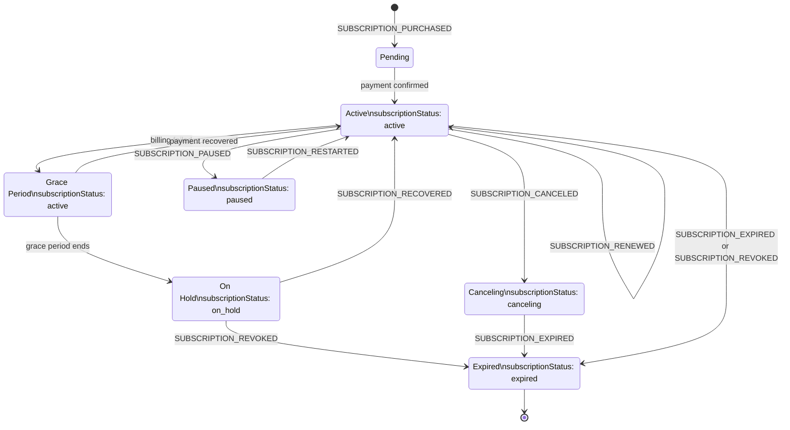
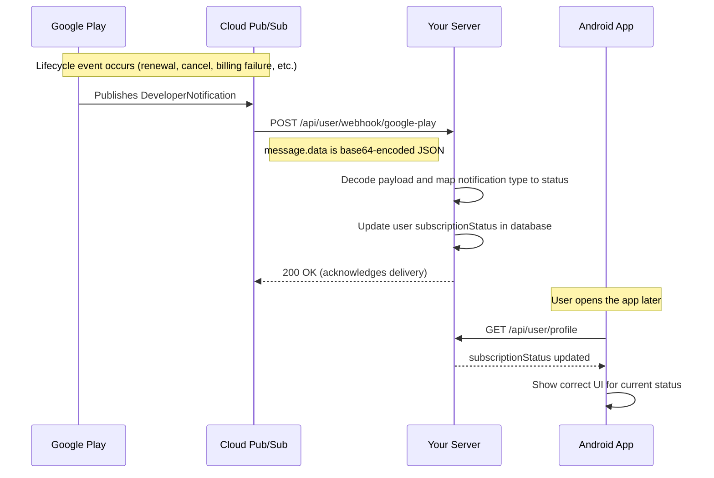

# Google Play Webhook

This endpoint receives real-time subscription and purchase lifecycle events from Google Play. It is called automatically by Google's infrastructure — **your Android app does not call this endpoint**.

Understanding what this webhook handles helps you know what subscription state changes your app should expect and when to refresh the user's profile.

---

## Endpoint

```
POST /api/user/webhook/google-play
```

**Auth:** None — called by Google's servers, not the app  
**Your app's role:** None. Just refresh the user profile when the app comes to the foreground.

---

## What This Webhook Handles

Google Play sends a notification whenever a subscription or purchase lifecycle event occurs. The server processes these and updates the user's subscription status automatically.

### Subscription events

| Event | What it means | Resulting status |
|---|---|---|
| `SUBSCRIPTION_PURCHASED` | New subscription started | `active` |
| `SUBSCRIPTION_RENEWED` | Auto-renewed successfully | `active` |
| `SUBSCRIPTION_RECOVERED` | Recovered after a billing hold | `active` |
| `SUBSCRIPTION_IN_GRACE_PERIOD` | Billing failed, grace period active | `active` |
| `SUBSCRIPTION_RESTARTED` | User reactivated a cancelled subscription | `active` |
| `SUBSCRIPTION_PRICE_CHANGE_CONFIRMED` | User accepted a price change | `active` |
| `SUBSCRIPTION_CANCELED` | User cancelled auto-renew (still active until period end) | `canceling` |
| `SUBSCRIPTION_EXPIRED` | Subscription has fully expired | `expired` |
| `SUBSCRIPTION_REVOKED` | Subscription revoked by Google | `expired` |
| `SUBSCRIPTION_ON_HOLD` | Account on hold due to billing failure | `paused` |
| `SUBSCRIPTION_PAUSED` | User paused the subscription | `paused` |

### One-time product events

| Event | What it means | Action taken |
|---|---|---|
| `ONE_TIME_PRODUCT_PURCHASED` | User bought a credit pack | Credits added to account |

### Voided purchase events

| Event | What it means | Action taken |
|---|---|---|
| Voided subscription | Purchase was voided (e.g. refund by Google) | Status set to `expired` |

### Subscription Lifecycle



---

## What Your App Should Do

Your app does not need to listen for or react to these webhook events in real time. Instead:

1. **After a successful `verify-purchase` call** — refresh the user profile to reflect the newly activated plan.
2. **On app foreground / resume** — call `GET /api/user/profile` to pick up any status changes that happened while the app was in the background (renewals, cancellations, billing failures, etc.).
3. **Show appropriate UI based on `subscriptionStatus`** in the profile response:

| `subscriptionStatus` | Recommended UI |
|---|---|
| `active` | Full access |
| `paused` | Prompt user to fix payment method in Play Store |
| `expired` | Show paywall / upsell screen |
| *(absent / null)* | User has never subscribed |

---

## Notes

- **Renewals happen silently** — the user's subscription status will be refreshed via this webhook. Your app just needs to re-fetch the profile periodically.
- If a subscription enters `paused` status, deep-link the user to the Play Store subscription management page:
  ```
  https://play.google.com/store/account/subscriptions?sku=<productId>&package=<packageName>
  ```
- `SUBSCRIPTION_CANCELED` means the user turned off auto-renew but is still active until the billing period ends. The status will change to `expired` when `SUBSCRIPTION_EXPIRED` is received. Your app may want to show a "renew" prompt in this state, but the user still has access.

---

## Notification and Sync Flow


