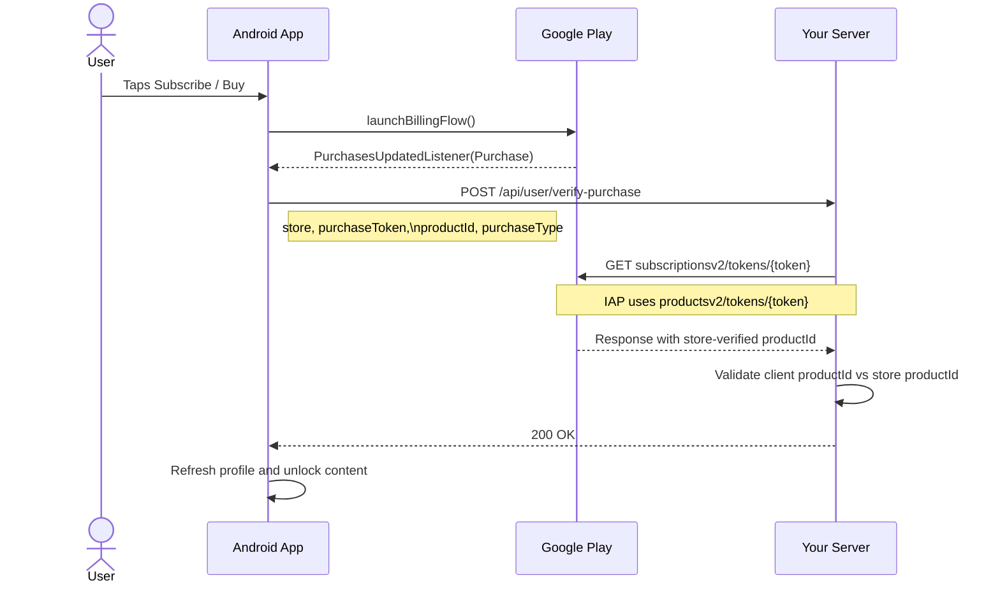
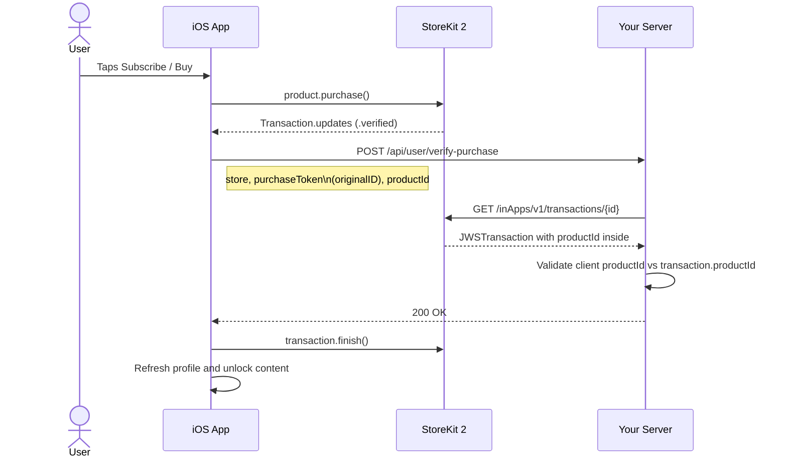
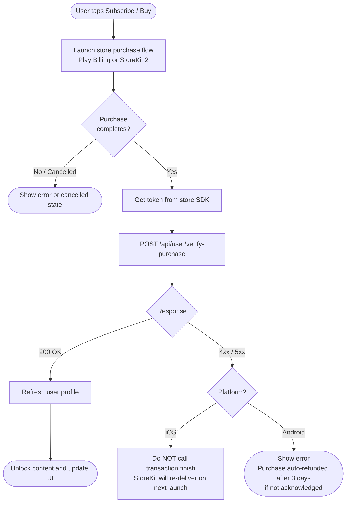

# Verify Purchase

Call this endpoint immediately after the user completes a purchase through the Play Billing Library (Android) or StoreKit 2 (iOS). It validates the purchase with the store and activates the subscription or credits on the user's account.

---

## Endpoint

```
POST /api/user/verify-purchase
```

**Auth:** `Authorization: Bearer <access_token>` (required)

---

## Request

### Headers

| Header          | Value                   |
| --------------- | ----------------------- |
| `Content-Type`  | `application/json`      |
| `Authorization` | `Bearer <access_token>` |

### Body

```json
{
  "store": "google",
  "purchaseToken": "<token>",
  "productId": "<product or subscription id>",
  "packageName": "com.yourapp",
  "purchaseType": "subscription"
}
```

| Field           | Type                        | Required | Description                                                                                                     |
| --------------- | --------------------------- | -------- | --------------------------------------------------------------------------------------------------------------- |
| `store`         | `"google"` \| `"apple"`     | Yes      | Which store the purchase came from                                                                              |
| `purchaseToken` | `string`                    | Yes      | See [Per-platform values](#per-platform-values) below                                                           |
| `productId`     | `string`                    | Yes      | The product or subscription ID as shown in your store console (e.g. `credits_100`). Sent as a cross-check — the server validates this against the `productId` the store API returns directly. A mismatch is logged as a warning and the store's value is used. |
| `packageName`   | `string`                    | No       | Android only — your app's package name (e.g. `com.yourapp`). Can be omitted if already configured on the server |
| `purchaseType`  | `"subscription"` \| `"iap"` | No       | Defaults to `"subscription"`. Use `"iap"` for one-time credit pack purchases                                    |

---

## Per-Platform Values

### Android (Google Play)

Use the values returned by the Play Billing Library after a successful purchase:

| Request field   | Where to get it                                                   |
| --------------- | ----------------------------------------------------------------- |
| `store`         | `"google"` (hardcoded)                                            |
| `purchaseToken` | `Purchase.purchaseToken`                                          |
| `productId`     | `Purchase.products[0]` — sent for cross-validation; server verifies against Google's API response |
| `packageName`   | Your app's `applicationId` from `build.gradle`                    |
| `purchaseType`  | `"subscription"` for subscriptions, `"iap"` for one-time products |

**Kotlin example:**

```kotlin
// Inside your PurchasesUpdatedListener
val purchase = purchases.first()

val body = JSONObject().apply {
    put("store", "google")
    put("purchaseToken", purchase.purchaseToken)
    put("productId", purchase.products.first())
    put("packageName", BuildConfig.APPLICATION_ID)
    put("purchaseType", "subscription") // or "iap"
}

apiClient.post("/api/user/verify-purchase", body, accessToken)
```

### iOS (StoreKit 2)

Use the values from the `Transaction` object after a successful purchase:

| Request field   | Where to get it                                                                  |
| --------------- | -------------------------------------------------------------------------------- |
| `store`         | `"apple"` (hardcoded)                                                            |
| `purchaseToken` | `transaction.originalID.description` (preferred) or `transaction.id.description` |
| `productId`     | `transaction.productID` — sent for cross-validation; server verifies against the Apple-signed `JWSTransaction` |
| `packageName`   | Not needed — omit this field                                                     |
| `purchaseType`  | `"subscription"` for auto-renewable subscriptions, `"iap"` for consumables       |

**Swift example:**

```swift
// Inside your purchase completion handler
for await result in Transaction.updates {
    guard case .verified(let transaction) = result else { continue }

    let body: [String: Any] = [
        "store": "apple",
        "purchaseToken": String(transaction.originalID),
        "productId": transaction.productID,
        "purchaseType": transaction.productType == .autoRenewable ? "subscription" : "iap"
    ]

    try await apiClient.post("/api/user/verify-purchase", body: body, accessToken: accessToken)
    await transaction.finish()
}
```

> **Important:** Call `transaction.finish()` only after you receive a successful `200` response. This tells StoreKit the purchase has been delivered.

---

## Integration Sequence

### Android (Google Play)



### iOS (StoreKit 2)



---

## Responses

### 200 — Success

The purchase was verified and the account has been updated.

```json
{
  "success": true,
  "message": "Subscription activated successfully.",
  "purchaseType": "subscription",
  "store": "google",
  "status": "active",
  "plan": {
    "id": "plan_abc123",
    "name": "Premium Monthly"
  }
}
```

- For `purchaseType: "iap"` the `message` will be `"Credits added successfully."`.
- `plan` is matched using the **store-verified** `productId` from the API response, not the client-provided value. Returns `null` if no matching plan is found.

### 400 — Invalid request

A required field is missing or has an invalid value.

```json
{
  "success": false,
  "message": "Invalid input.",
  "errors": {
    "fieldErrors": {
      "store": ["Invalid enum value. Expected 'google' | 'apple'"]
    }
  }
}
```

Check `errors.fieldErrors` to see which fields failed validation.

### 401 — Unauthorized

The access token is missing or expired. Refresh the token and retry.

```json
{
  "success": false,
  "message": "Unauthorized."
}
```

### 402 — Purchase not active

The purchase token exists but the purchase is not in an active state (e.g. already expired, refunded, or pending).

```json
{
  "success": false,
  "message": "Purchase could not be verified. Status: expired",
  "status": "expired"
}
```

Possible `status` values:

| Status          | Meaning                                                    |
| --------------- | ---------------------------------------------------------- |
| `active`        | Purchase is valid and active (you won't see this on a 402) |
| `expired`       | Subscription has expired or was refunded                   |
| `on_hold`       | Account on hold (billing issue)                            |
| `billing_retry` | In billing retry period                                    |
| `unknown`       | State could not be determined                              |

### 403 — Account banned

```json
{
  "success": false,
  "message": "Your account has been banned."
}
```

### 404 — User not found

The authenticated user's account does not exist on the server.

```json
{
  "success": false,
  "message": "User not found."
}
```

### 500 — Server error

Something went wrong on the server. Retry after a short delay. If the problem persists, contact backend support.

```json
{
  "success": false,
  "message": "Internal server error while verifying purchase."
}
```

---

## Recommended Integration Flow



---

## Notes

- **`productId` is cross-validated server-side** — the server extracts the authoritative `productId` directly from Google's or Apple's API response and uses it for plan lookup. The client-supplied value is used only as a last-resort fallback. If the two values differ, a warning is logged and the store's value wins. This prevents a malicious client from purchasing a cheap product but claiming a more expensive `productId` to receive more credits.
- **Call this as soon as checkout completes**, before navigating away from the purchase screen.
- On **iOS**, do not call `transaction.finish()` until you receive a `200` from this endpoint. If you finish the transaction before verification, StoreKit will not re-deliver it on the next launch.
- On **Android**, the purchase will remain in a `PURCHASED` (unacknowledged) state for 3 days. If it is not acknowledged within that window, Google will automatically refund it. Calling this endpoint acknowledges it server-side.
- If the `200` response is lost (network error after the server already processed it), calling this endpoint again with the same token is safe — the server is idempotent for the same purchase token.
