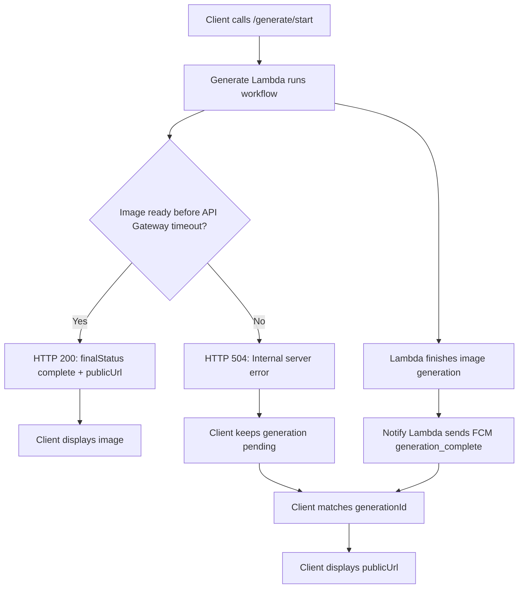
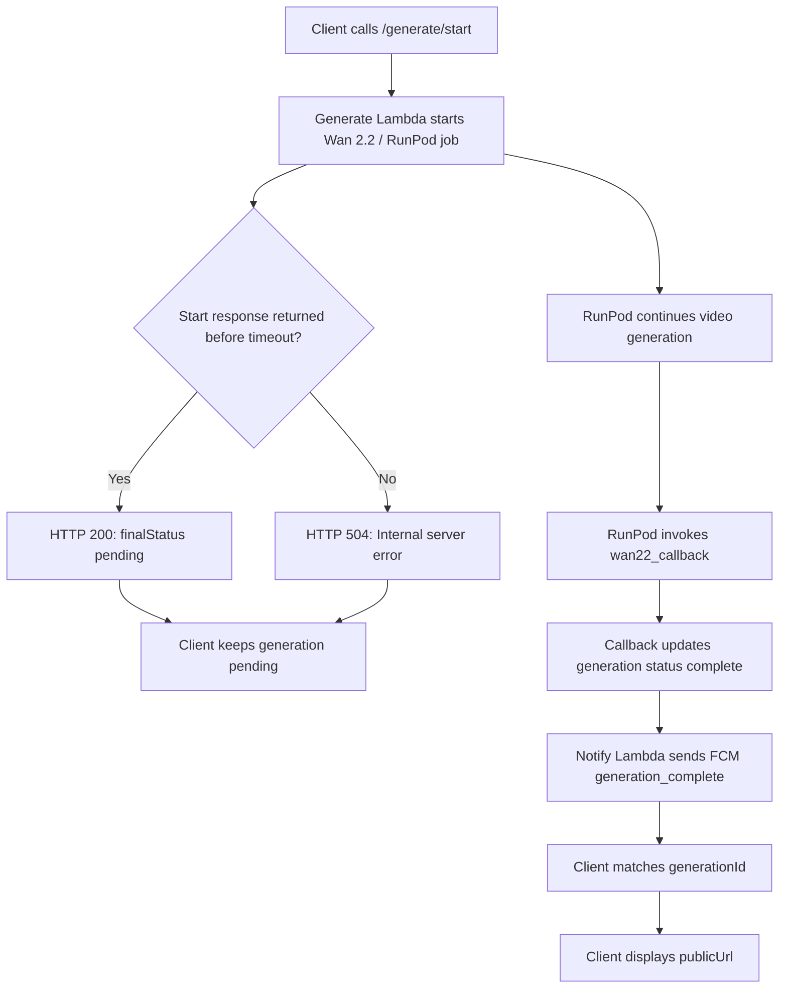
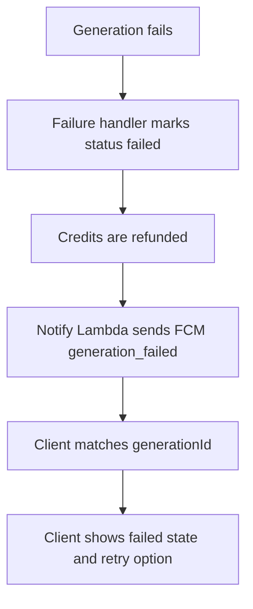

# User API — Reference Documentation

> **Base URL** `https://<UserHttpApi-ID>.execute-api.<region>.amazonaws.com`
>
> All protected routes require an `Authorization: Bearer <access_token>` header.

---

## Table of Contents

1. [User Profile](#1-user-profile)
2. [Templates](#2-templates)
   - [List Templates](#21-list-templates)
   - [List Sub-Templates](#22-list-sub-templates)
3. [Generation](#3-generation)
   - [Initiate Generation](#31-initiate-generation)
   - [Start Generation](#32-start-generation)
   - [Generation History](#33-generation-history)
4. [Plans & Purchases](#4-plans--purchases)
5. [Error Reference](#5-error-reference)
6. [Generation Lifecycle](#6-generation-lifecycle)

---

## Common Conventions

### Authentication

Protected routes use a **custom Lambda JWT authorizer**. The authorizer validates the Bearer token and injects the user's `email` into the request context.

```
Authorization: Bearer <access_token>
```

### Response Envelope

```json
{ "success": true, ...data }
{ "error": "human-readable message" }
```

---

## 1. User Profile

### 1.1 Get Profile

```
GET /api/user/profile
Authorization: Bearer <token>
```

**Response 200**

```json
{
  "success": true,
  "profile": {
    "email": "user@example.com",
    "name": "Jane Doe",
    "credits": 250,
    "createdAt": 1714247549000,
    "status": "active"
  }
}
```

| Status | Response |
|--------|----------|
| 401 | `{ "message": "Unauthorized missing identity context.", "success": false }` |
| 403 | `{ "message": "Your account has been banned. Please contact support.", "success": false }` |
| 404 | `{ "message": "User not found.", "success": false }` |

---

## 2. Templates

### 2.1 List Templates

Returns all **Active** deployed workflow templates.

```
GET /api/user/templates
Authorization: Bearer <token>
```

**Response 200**

```json
{
  "success": true,
  "templates": [
    {
      "category": "General",
      "credits": 60,
      "workflowId": "f5536d77-c551-44fc-a2ca-fc3fdf5da528",
      "description": "Powerful automated workflow ready for deployment.",
      "name": "Cartoon Romantic Hug",
      "schema": {
        "summary": {
          "hasWan22": false,
          "userImageInputCount": 2,
          "outputVideoCount": 0,
          "outputImageCount": 1,
          "fixedTextCount": 1,
          "fixedVideoCount": 0,
          "hasGemini": true,
          "outputType": "image",
          "fixedImageCount": 0,
          "userTextInputCount": 0,
          "userVideoInputCount": 0
        }
      }
    },
    {
      "category": "General",
      "credits": 100,
      "workflowId": "ac005294-d724-4380-8c31-b68a79978b8b",
      "description": "Powerful automated workflow ready for deployment.",
      "name": "Man with dog",
      "schema": {
        "summary": {
          "hasWan22": true,
          "userImageInputCount": 1,
          "outputVideoCount": 1,
          "outputImageCount": 0,
          "fixedTextCount": 2,
          "hasGemini": true,
          "outputType": "video",
          "fixedImageCount": 1,
          "fixedVideoCount": 0,
          "userTextInputCount": 0,
          "userVideoInputCount": 0
        }
      }
    },
    {
      "category": "General",
      "credits": 100,
      "workflowId": "2ffd77a3-3d50-4931-89c9-4105f706c41e",
      "description": "Powerful automated workflow ready for deployment.",
      "name": "Image to Video",
      "schema": {
        "summary": {
          "hasWan22": true,
          "userImageInputCount": 1,
          "outputVideoCount": 1,
          "outputImageCount": 0,
          "fixedTextCount": 0,
          "hasGemini": false,
          "outputType": "video",
          "fixedImageCount": 0,
          "fixedVideoCount": 0,
          "userTextInputCount": 1,
          "userVideoInputCount": 0
        }
      }
    }
  ],
  "templateOrder": [
    "8d0c436e-7225-4796-8ae1-a58c26b3e28d",
    "63e79239-8420-4088-97a4-c0e78cb3931f",
    "56aad5c6-0c56-4318-a73f-57bcf6875ddb",
    "59731e6a-8550-45fd-b248-f370221118cb",
    "f5536d77-c551-44fc-a2ca-fc3fdf5da528",
    "2ffd77a3-3d50-4931-89c9-4105f706c41e"
  ]
}
```

**Template fields**

| Field | Type | Description |
|-------|------|-------------|
| `workflowId` | `string` | Unique identifier — use for all subsequent calls |
| `name` | `string` | Display name |
| `description` | `string` | Short description |
| `category` | `string` | Content category (e.g. `"General"`) |
| `credits` | `number` | Credits required to run this workflow |
| `schema.summary` | `object` | Quick-look metadata (see below) |
| `templateOrder` | `string[]` | Ordered list of `workflowId`s for display |

**`schema.summary` fields**

| Field | Type | Description |
|-------|------|-------------|
| `outputType` | `string` | `"image"` or `"video"` |
| `hasWan22` | `boolean` | Whether the workflow uses async RunPod video generation |
| `hasGemini` | `boolean` | Whether the workflow uses Gemini AI |
| `userImageInputCount` | `number` | Number of image inputs the user must supply |
| `userTextInputCount` | `number` | Number of text inputs the user must supply |
| `userVideoInputCount` | `number` | Number of video inputs the user must supply |
| `outputImageCount` | `number` | Number of output images produced |
| `outputVideoCount` | `number` | Number of output videos produced |
| `fixedImageCount` | `number` | Number of fixed (preset) image assets |
| `fixedVideoCount` | `number` | Number of fixed (preset) video assets |
| `fixedTextCount` | `number` | Number of fixed (preset) text prompts |

---

### 2.2 List Sub-Templates

Returns example sub-templates for a workflow. Each sub-template shows a sample output and the input schema the user must fill.

```
GET /api/user/sub-templates/{workflowId}
Authorization: Bearer <token>
```

**Path Parameters**

| Parameter | Required | Description |
|-----------|----------|-------------|
| `workflowId` | YES | The `workflowId` from List Templates |

**Response 200 — Image workflow (e.g. Cartoon Romantic Hug)**

```json
{
  "success": true,
  "subTemplates": [
    {
      "id": "fc92b995-1a59-449a-8cba-07bd7eb37156",
      "workflowId": "f5536d77-c551-44fc-a2ca-fc3fdf5da528",
      "title": "Anime style couple",
      "outputType": "image",
      "url": "https://d1vglztnil4ntd.cloudfront.net/workflows/f5536d77-c551-44fc-a2ca-fc3fdf5da528/fc92b995-1a59-449a-8cba-07bd7eb37156/composite-fc92b995-1a59-449a-8cba-07bd7eb37156-1779646778557.jpg",
      "userInputsSchema": [
        {
          "feedsInto": ["geminiGen"],
          "inputType": "image",
          "label": "Female Character",
          "nodeId": "inputImage-1779517346478"
        },
        {
          "feedsInto": ["geminiGen"],
          "inputType": "image",
          "label": "Male Character",
          "nodeId": "inputImage-1779517355455"
        }
      ]
    }
  ]
}
```

**Response 200 — Mixed text + image workflow**

```json
{
  "success": true,
  "subTemplates": [
    {
      "id": "08128ed9-03f1-4ed6-bd4f-41de22cd3f95",
      "workflowId": "d59d2ad2-fb2d-4f32-9880-9833a712aefc",
      "title": "Text + Image",
      "outputType": "image",
      "url": "https://d1vglztnil4ntd.cloudfront.net/workflows/d59d2ad2-fb2d-4f32-9880-9833a712aefc/08128ed9-03f1-4ed6-bd4f-41de22cd3f95/composite-08128ed9-03f1-4ed6-bd4f-41de22cd3f95-1779780981081.jpg",
      "userInputsSchema": [
        {
          "feedsInto": ["geminiGen"],
          "inputType": "text",
          "label": "Text Prompt",
          "nodeId": "inputText-1777725565305"
        },
        {
          "feedsInto": ["geminiGen"],
          "inputType": "image",
          "label": "Image 1",
          "nodeId": "inputImage-1779641898416"
        }
      ]
    }
  ]
}
```

> The `url` field shows an example of how the output will look once generation is complete. Use it as a preview/thumbnail in your UI.

**`subTemplates` item fields**

| Field | Type | Description |
|-------|------|-------------|
| `id` | `string` | Sub-template ID — pass as `subTemplateId` when initiating |
| `workflowId` | `string` | Parent workflow ID |
| `title` | `string` | Short description of this example |
| `outputType` | `string` | `"image"` or `"video"` |
| `url` | `string` | CloudFront URL of the example output image/video (for preview) |
| `userInputsSchema` | `object[]` | Ordered list of inputs the user must supply |

**`userInputsSchema` item**

| Field | Type | Description |
|-------|------|-------------|
| `nodeId` | `string` | Node ID — use as the key in `userInputs` at generation time |
| `inputType` | `string` | `"image"`, `"video"`, or `"text"` |
| `label` | `string` | Human-readable label to display in the UI |
| `feedsInto` | `string[]` | Which processing nodes consume this input |

> **UI note:** For `inputType: "text"` show a text box. For `inputType: "image"` or `"video"` show a file picker. The order of items in `userInputsSchema` is the recommended display order.

| Status | Response |
|--------|----------|
| 401 | `{ "error": "unauthorized" }` |
| 404 | `{ "error": "workflow not found" }` |

---

## 3. Generation

Generating content is a **three-step process**:

```
Step 1 → POST /api/user/generate/initiate
         Deducts credits, returns generationId + presigned S3 upload URLs

Step 2 → PUT <uploadUrl>  (direct S3 upload — for each image/video input)

Step 3 → POST /api/user/generate/start
         Executes the AI workflow, returns result or pending status
```

---

### 3.1 Initiate Generation

Creates a generation job, deducts credits, and returns presigned S3 URLs for each media input node.

```
POST /api/user/generate/initiate
Authorization: Bearer <token>
Content-Type: application/json
```

**Request Body**

```json
{
  "workflowId": "f5536d77-c551-44fc-a2ca-fc3fdf5da528",
  "subTemplateId": "4b8ffff8-0c32-4fbb-a56f-92f4e076e238",
  "platform": "android",
  "fcmToken": "dAFe8N5GfAyVOKW1L_4jh9:APA91bErYXPEIFR44U443cRi122Pmx..."
}
```

| Field | Type | Required | Description |
|-------|------|----------|-------------|
| `workflowId` | `string` | YES | From List Templates |
| `subTemplateId` | `string` | YES | From List Sub-Templates |
| `platform` | `string` | YES | `"android"` or `"ios"` |
| `fcmToken` | `string` | NO | FCM device token for push notifications |

**Response 200**

```json
{
  "success": true,
  "generationId": "8dc4e5cf-d180-42df-856d-3b6cc2c8fd7c",
  "uploadUrls": [
    {
      "nodeId": "inputImage-1779517355455",
      "uploadUrl": "https://admin-backend-userss3bucket-axyhz3k8yruh.s3.ap-south-1.amazonaws.com/user_assets/8dc4e5cf-d180-42df-856d-3b6cc2c8fd7c/inputImage-1779517355455_1779780389434_upload_1779780389434.jpg?X-Amz-Algorithm=AWS4-HMAC-SHA256&...",
      "key": "user_assets/8dc4e5cf-d180-42df-856d-3b6cc2c8fd7c/inputImage-1779517355455_1779780389434_upload_1779780389434.jpg",
      "inputType": "image"
    },
    {
      "nodeId": "inputImage-1779517346478",
      "uploadUrl": "https://admin-backend-userss3bucket-axyhz3k8yruh.s3.ap-south-1.amazonaws.com/user_assets/8dc4e5cf-d180-42df-856d-3b6cc2c8fd7c/inputImage-1779517346478_1779780389595_upload_1779780389595.jpg?X-Amz-Algorithm=AWS4-HMAC-SHA256&...",
      "key": "user_assets/8dc4e5cf-d180-42df-856d-3b6cc2c8fd7c/inputImage-1779517346478_1779780389595_upload_1779780389595.jpg",
      "inputType": "image"
    }
  ]
}
```

> Only `inputType: "image"` and `inputType: "video"` nodes appear in `uploadUrls`. Text nodes do not require an upload.

**`uploadUrls` item fields**

| Field | Type | Description |
|-------|------|-------------|
| `nodeId` | `string` | Matches a `nodeId` from `userInputsSchema` |
| `uploadUrl` | `string` | Presigned S3 PUT URL (valid for **1 hour**) |
| `key` | `string` | S3 object key — use this as the value for image/video inputs in Step 3 |
| `inputType` | `string` | `"image"` or `"video"` |

**After this call — upload each file:**

```
PUT <uploadUrl>
Content-Type: image/jpeg   (or video/mp4 for video)
Body: <raw binary file>
```

Expected response: `200 OK` (no body) from S3.

**Error responses**

| Status | Body |
|--------|------|
| 400 | `{ "error": "missing workflowId or subTemplateId" }` |
| 400 | `{ "error": "invalid or missing platform. Must be 'android' or 'ios'" }` |
| 401 | `{ "error": "unauthorized" }` |
| 403 | `{ "success": false, "error": "insufficient credits" }` |
| 404 | `{ "error": "workflow not found" }` |
| 404 | `{ "error": "sub-template not found" }` |
| 500 | `{ "error": "<message>" }` |

---

### 3.2 Start Generation

Executes the AI workflow. Runs synchronously up to ~29 s (API Gateway limit). Image workflows typically complete synchronously; video workflows (`hasWan22: true`) always return `"pending"` and deliver the result via push notification.

```
POST /api/user/generate/start
Authorization: Bearer <token>
Content-Type: application/json
```

**Request Body**

```json
{
  "generationId": "8dc4e5cf-d180-42df-856d-3b6cc2c8fd7c",
  "userInputs": {
    "inputImage-1779517355455": "user_assets/8dc4e5cf-d180-42df-856d-3b6cc2c8fd7c/inputImage-1779517355455_1779780389434_upload_1779780389434.jpg",
    "inputImage-1779517346478": "user_assets/8dc4e5cf-d180-42df-856d-3b6cc2c8fd7c/inputImage-1779517346478_1779780389595_upload_1779780389595.jpg"
  }
}
```

For a workflow that also takes text input:

```json
{
  "generationId": "d59d2ad2-fb2d-4f32-9880-9833a712aefc",
  "userInputs": {
    "inputText-1777725565305": "Generate image of a sunset over mountains",
    "inputImage-1779641898416": "user_assets/86cc7f74-e5b1-426b-b813-ca125d329b93/inputImage-1779641898416_1779781318486_upload_1779781318486.jpg"
  }
}
```

| Field | Type | Required | Description |
|-------|------|----------|-------------|
| `generationId` | `string` | YES | Returned by Initiate Generation |
| `userInputs` | `object` | NO | Key-value map of `nodeId → value` |

**`userInputs` values by node type**

| Node ID pattern | Value | Source |
|-----------------|-------|--------|
| `inputText-*` | Free text string | User types this |
| `inputImage-*` | S3 `key` from initiate response | Returned by Step 1 |
| `inputVideo-*` | S3 `key` from initiate response | Returned by Step 1 |

---

#### Case A — Image generation, completes within 29 s

**Response 200**

```json
{
  "success": true,
  "finalStatus": "complete",
  "publicUrl": "https://d397ajnx16aos2.cloudfront.net/outputs/d59d2ad2-fb2d-4f32-9880-9833a712aefc/08128ed9-03f1-4ed6-bd4f-41de22cd3f95/gen_geminiGen-1777725580808_1779782169060.png?Expires=1780991769&Key-Pair-Id=K30CDW4COTXU9V&Signature=..."
}
```

The `publicUrl` is a signed CloudFront URL valid for **14 days**.

---

#### Case B — Video generation (`hasWan22: true`)

Video generation is always asynchronous. The API returns immediately with:

**Response 200**

```json
{
  "success": true,
  "finalStatus": "pending"
}
```

The result is delivered via FCM push notification when RunPod completes (see [Async Notifications](#async-notifications) below).

---

#### Case C — API Gateway timeout (504) for image generation

If image generation exceeds ~29 s, API Gateway closes the connection and responds with:

**Response 504**

```json
{
  "message": "Internal server error"
}
```

The Lambda continues running in the background. When the image is ready, the result is delivered via **FCM push notification** (same payload as Case A, sent via the notify Lambda):

```json
{
  "type": "generation_complete",
  "generationId": "8dc4e5cf-d180-42df-856d-3b6cc2c8fd7c",
  "finalStatus": "complete",
  "publicUrl": "https://d397ajnx16aos2.cloudfront.net/outputs/..."
}
```

---

#### Case D — API Gateway timeout (504) for video generation

Same 504 HTTP response as Case C. The video generation continues on RunPod. The result is delivered via FCM push notification triggered by the **`wan22_callback`** Lambda when RunPod completes (see [Async Notifications](#async-notifications)).

---

#### Other error responses

| Status | Body |
|--------|------|
| 400 | `{ "error": "missing generationId" }` |
| 400 | `{ "error": "cannot start in processing state" }` |
| 401 | `{ "error": "unauthorized" }` |
| 404 | `{ "error": "generation record not found or access denied" }` |
| 500 | `{ "error": "<message>" }` (credits automatically refunded) |

---

### Async Notifications

FCM is the fallback and final-result channel for generation requests that cannot return the finished media inside the `/api/user/generate/start` HTTP response.

To receive notifications, send both fields in `/api/user/generate/initiate`:

```json
{
  "platform": "android",
  "fcmToken": "<firebase-device-token>"
}
```

| Field | Required for FCM | Description |
|-------|------------------|-------------|
| `platform` | YES | Must be `"android"` or `"ios"`. Used by the notification Lambda to build the platform-specific FCM payload. |
| `fcmToken` | YES | Firebase device token for the user's current device/session. Without this, the app must rely only on polling/history. |

#### FCM delivery charts

Image generation result delivery:



Video generation result delivery:



Failure delivery:



#### Image generation notification

Image generation usually returns synchronously:

```json
{
  "success": true,
  "finalStatus": "complete",
  "publicUrl": "https://d397ajnx16aos2.cloudfront.net/outputs/..."
}
```

If image generation takes longer than the API Gateway limit, the HTTP request returns `504`:

```json
{
  "message": "Internal server error"
}
```

The Lambda can still finish after the client receives the `504`. In that case, the app receives this FCM data payload:

```json
{
  "type": "generation_complete",
  "generationId": "8dc4e5cf-d180-42df-856d-3b6cc2c8fd7c",
  "finalStatus": "complete",
  "publicUrl": "https://d397ajnx16aos2.cloudfront.net/outputs/..."
}
```

Client behavior for image jobs:

| Event | What app should do |
|-------|--------------------|
| `/generate/start` returns `200 complete` | Show `publicUrl` immediately. |
| `/generate/start` returns `504` | Keep the generation in a loading/pending state and wait for `type: "generation_complete"` notification. |
| FCM `generation_complete` arrives | Use `generationId` to match the pending request and display `publicUrl`. |
| No FCM received | Refresh `/api/user/generation-history` and match by `generationId`. |

#### Video generation notification

Video generation uses Wan 2.2 / RunPod and is asynchronous. A normal video request returns:

```json
{
  "success": true,
  "finalStatus": "pending"
}
```

This means the request started successfully, but the final video is not ready yet. The final result is sent later by `wan22_callback` after RunPod completes.

If `/generate/start` itself runs longer than the API Gateway limit, the user may receive `504`:

```json
{
  "message": "Internal server error"
}
```

Even in that case, the RunPod job may continue. The app should keep the generation pending and wait for the final FCM completion notification.

Video completion payload sent by `wan22_callback`:

```json
{
  "type": "generation_complete",
  "generationId": "8dc4e5cf-d180-42df-856d-3b6cc2c8fd7c",
  "workflowId": "ac005294-d724-4380-8c31-b68a79978b8b",
  "subTemplateId": "4b8ffff8-0c32-4fbb-a56f-92f4e076e238",
  "publicUrl": "https://d397ajnx16aos2.cloudfront.net/outputs/...?Expires=...&Key-Pair-Id=...&Signature=...",
  "status": "complete"
}
```

Client behavior for video jobs:

| Event | What app should do |
|-------|--------------------|
| `/generate/start` returns `200 pending` | Show pending/processing state for this `generationId`. |
| `/generate/start` returns `504` | Do not mark failed immediately. Keep pending and wait for FCM or history refresh. |
| FCM `generation_complete` arrives with `videoUrl` / `publicUrl` | Mark generation complete and display `publicUrl`. |
| No FCM received | Refresh `/api/user/generation-history` and match by `generationId`. |

#### Failure notification

If generation fails after credits were deducted, credits are automatically refunded and the app receives:

```json
{
  "type": "generation_failed",
  "generationId": "8dc4e5cf-d180-42df-856d-3b6cc2c8fd7c",
  "reason": "runpod_job_failed: ..."
}
```

Client behavior for failures:

| Event | What app should do |
|-------|--------------------|
| FCM `generation_failed` arrives | Mark the generation failed and show a retry option. |
| `reason` is present | Log/display a user-safe error message. |
| Credits were deducted | Treat them as refunded by backend failure handling. |

---

### 3.3 Generation History

```
GET /api/user/generation-history
Authorization: Bearer <token>
```

Returns the authenticated user's AI generation history for the **last 14 days**, sorted by creation time descending.

**Response 200**

```json
{
  "success": true,
  "history": [
    {
      "id": "user@example.com",
      "generationId": "8dc4e5cf-d180-42df-856d-3b6cc2c8fd7c",
      "workflowId": "f5536d77-c551-44fc-a2ca-fc3fdf5da528",
      "subTemplateId": "4b8ffff8-0c32-4fbb-a56f-92f4e076e238",
      "status": "complete",
      "createdAt": 1777534739389,
      "creditUsed": 60,
      "publicUrl": "https://d397ajnx16aos2.cloudfront.net/outputs/.../result.jpg"
    }
  ]
}
```

**History item fields**

| Field | Type | Description |
|-------|------|-------------|
| `generationId` | `string` | Unique ID of this generation run |
| `workflowId` | `string` | Which workflow was used |
| `subTemplateId` | `string` | Which sub-template was used |
| `status` | `string` | See status table below |
| `createdAt` | `number` | Unix timestamp in milliseconds |
| `creditUsed` | `number` | Credits deducted for this job |
| `publicUrl` | `string` | Signed CloudFront URL (valid 14 days). Only present when `status` is `"complete"` |

**Status values**

| Status | Description |
|--------|-------------|
| `initiated` | Job created, credits deducted, media not yet uploaded |
| `processing` | AI workflow is actively running |
| `pending` | Async video generation in progress on RunPod |
| `complete` | Generation finished successfully |
| `failed` | Generation failed; credits were refunded automatically |

---

## 4. Plans & Purchases

### 4.1 Get Plans

```
GET /api/user/plans?platform=android
Authorization: Bearer <token>
```

**Query Parameters**

| Parameter | Required | Default | Description |
|-----------|----------|---------|-------------|
| `platform` | NO | `"android"` | `"android"` or `"ios"` |

**Response 200**

```json
{
  "success": true,
  "platform": "android",
  "plans": [
    {
      "id": "plan_basic",
      "name": "Basic",
      "category": "plan",
      "status": "Active",
      "features": ["100 credits/month", "No ads"],
      "highlighted": false,
      "billing": "monthly",
      "monthlyPrice": 4.99,
      "yearlyPrice": 49.99,
      "playStoreId": "com.example.app.basic_monthly",
      "appStoreId": "com.example.app.basic_monthly"
    }
  ],
  "iaps": [
    {
      "id": "iap_credits_100",
      "name": "100 Credits",
      "category": "iap",
      "status": "Active",
      "price": 0.99,
      "playStoreId": "com.example.app.credits_100",
      "appStoreId": "com.example.app.credits_100"
    }
  ]
}
```

---

## 5. Error Reference

| HTTP Status | Common Causes |
|-------------|---------------|
| 400 | Missing required fields, invalid JSON, wrong state |
| 401 | Missing or invalid `Authorization` header |
| 403 | Insufficient credits, banned account |
| 404 | Resource not found or not owned by the user |
| 504 | API Gateway timeout (29 s exceeded) — result delivered via push notification |
| 500 | Unexpected server error |

---

## 6. Generation Lifecycle

```
Client                        API                         External
  |                             |                              |
  |-- GET /templates ---------->|                              |
  |<-- { templates, order } ----|                              |
  |                             |                              |
  |-- GET /sub-templates/{id} ->|                              |
  |<-- { subTemplates } --------|                              |
  |                             |                              |
  |-- POST /generate/initiate ->|                              |
  |   workflowId, subTemplateId |-- Deduct credits (DynamoDB) |
  |   platform, fcmToken        |-- Generate presigned URLs    |
  |<-- { generationId,          |                              |
  |      uploadUrls } ----------|                              |
  |                             |                              |
  |-- PUT <uploadUrl> (S3) ---------------------->| S3         |
  |<-- 200 OK -------------------------------------------|    |
  |                             |                              |
  |-- POST /generate/start ---->|                              |
  |   generationId, userInputs  |-- Run AI workflow            |
  |                             |   +-- Gemini (image) ------->| Gemini
  |                             |   +-- RunPod (video) ------->| RunPod
  |                             |                              |
  | [Image, within 29s]         |                              |
  |<-- { finalStatus:"complete",|                              |
  |      publicUrl } -----------|                              |
  |                             |                              |
  | [Image OR Video, >29s]      |                              |
  |<-- 504 timeout -------------|                              |
  |        (Lambda still runs)  |-- FCM push when done ------->| FCM
  |<-- push notification -----------------------------------|   |
  |                             |                              |
  | [Video, always pending]     |                              |
  |<-- { finalStatus:"pending" }|                              |
  |                             |       RunPod completes ------>|
  |                             |<-- wan22_callback invoked ----|
  |                             |-- Update DB, send FCM ------->| FCM
  |<-- push notification -----------------------------------|   |
  |                             |                              |
  |-- GET /generation-history ->|                              |
  |<-- { history: [...] } ------|                              |
```

### Credit Behaviour

- Credits are **deducted atomically** during `initiate`. Insufficient credits → `403` immediately.
- If generation **fails** at any point, credits are **automatically refunded**.
- The deducted amount equals the workflow's configured `credits` value.
